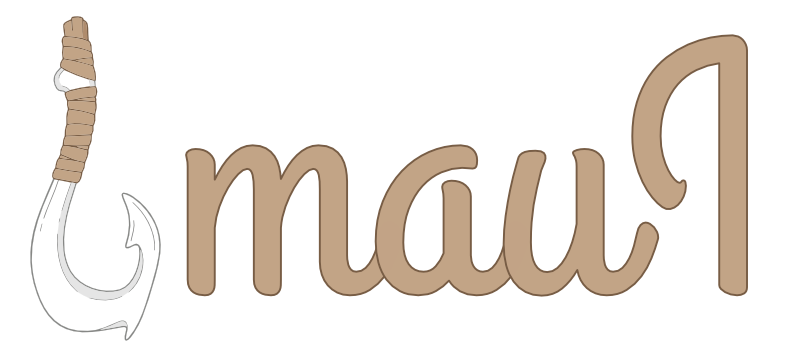

<p align="center">
  
</p>

**<span style="color:#C2A486">🪝maui</span>** stands for **M**ulti **A**gents **U**nique **I**nstall.

**A global, multi-agent toolset installer.** One command installs a plugin's
skills, agents, commands, rules, and hooks into whichever AI coding agents
you actually have on your machine — Claude Code, Codex CLI, Gemini CLI,
OpenCode, Grok CLI, Cursor, Windsurf, and Kiro — using each agent's own
native install mechanism where one exists, and a clean symlink strategy
everywhere else.

```
$ maui install github.com/example-user/example-plugin
Installed example-plugin → claude-code, kiro, _default
```

No manual copying of files into `~/.claude/`, `~/.cursor/`, or any other
agent-specific folder. No re-doing the same install by hand on every
machine. One manifest, one command.

---

## Table of Contents

- [Requirements](#requirements)
- [Installation](#installation)
- [Quick Start](#quick-start)
- [How maui Works](#how-maui-works)
- [Supported Agents](#supported-agents)
- [OpenCode Plugins vs. Claude/Codex Hooks](#opencode-plugins-vs-claudecodex-hooks)
- [CLI Reference](#cli-reference)
- [The Plugin Manifest (`maui.json`)](#the-plugin-manifest-mauijson)
- [Postinstall & Postremove Hooks](#postinstall--postremove-hooks)
- [Scaffolding a Plugin or Marketplace](#scaffolding-a-plugin-or-marketplace)
- [Using What You Scaffolded](#using-what-you-scaffolded)
- [Files & Directories maui Manages](#files--directories-maui-manages)
- [FAQ](#faq)
- [Contributing](#contributing)

---

## Requirements

<span style="color:#C2A486">🪝maui</span>   is **Bun-only, deliberately**. Its CLI entrypoint requires the `bun`
binary to run at all, and its core relies on Bun-native APIs (`Bun.file`,
`Bun.write`, `Bun.which`, `Bun.$`) rather than Node equivalents — that's
what keeps adapters and postinstall scripts small and dependency-free.

You'll also want `git` on your `$PATH` (used to fetch plugin sources), and
whichever of the supported agent CLIs you actually use — maui only acts on
the ones it detects.

## Installation

<span style="color:#C2A486">🪝maui</span>   is **not published to the npm registry** — it's distributed straight
from its GitHub repo using Bun's `github:` dependency specifier, which
`bunx`/`bun add` resolve without touching npm at all.

Run it without installing anything, via `bunx`:

```bash
bunx github:<owner>/maui install github.com/example-user/example-plugin
```

Each invocation fetches the current `main` branch and runs it — nothing is
left behind. For a persistent `maui` command on your `$PATH` instead:

```bash
bun add -g github:<owner>/maui
```

To update later, just re-run the same `bun add -g` command — it re-fetches
the latest commit.

> **Note:** both forms require Bun (the CLI's shebang is
> `#!/usr/bin/env bun`, and `bunx`/`bun add` execute it directly as
> TypeScript — there's no compiled JS artifact and no separate `npm
> install` step involved).

## Quick Start

```bash
# Install a plugin — maui detects which agents are on this machine
# and does the right thing for each one.
maui install github.com/example-user/example-plugin

# See what's installed, and where.
maui list

# Pull the latest version.
maui update example-plugin

# Remove it everywhere it was installed.
maui remove example-plugin

# Start a brand new plugin from scratch, ready to publish.
maui create-plugin my-new-plugin
```

## How maui Works

Every agent <span style="color:#C2A486">🪝maui</span>   supports falls into exactly one of two categories, and
<span style="color:#C2A486">🪝maui</span>   treats them completely differently:

**Native-marketplace agents** (Claude Code, Codex CLI, Gemini CLI, Grok CLI)
each ship their own plugin/extension manager. For these, <span style="color:#C2A486">🪝maui</span>   never touches
a single file on disk — it shells out to that agent's own CLI
(`claude plugin install`, `gemini extensions install`, and so on) and lets
the agent manage its own cache, versioning, and enable/disable state
exactly as if you'd typed the command yourself.

**Symlink agents** (Cursor, Windsurf, Kiro, OpenCode, and the always-on
`.agents/` fallback described below) have no such install mechanism — just
a folder convention they read from. For these, maui fetches the plugin's
source once into its own cache (`~/.maui/plugins/<name>`) and symlinks each
individual skill/command/rule *file* into the agent's folder — never the
parent folder itself, so two different plugins can safely contribute into
the same `skills/` directory without clobbering each other. OpenCode is a
symlink agent too, even though it has a real CLI — see
[OpenCode Plugins vs. Claude/Codex Hooks](#opencode-plugins-vs-claudecodex-hooks)
below for why.

**The `.agents/` fallback is always populated**, on every install,
regardless of which agents were actually detected. It's a safety net: even
on a machine where maui doesn't recognize a single installed agent, the
plugin's files still land somewhere predictable (`~/.agents/skills/…`), and
OpenCode's own skill/command/agent loaders already read from exactly that
path by convention, on top of its own dedicated `.config/opencode/` target.

**A failing agent never blocks the others.** If Claude Code is installed
but the plugin hasn't been pushed to GitHub yet, `claude plugin install`
will fail — <span style="color:#C2A486">🪝maui</span>   catches that, reports it, and keeps going with every other
agent that *did* succeed, rather than aborting the whole install.

**Global vs. project scope.** By default, everything installs globally
(`~/.claude/…`, `~/.agents/…`, and so on). Pass `--scope project` and
symlink-based agents install into the current repository instead
(`./.agents/…`, `./.cursor/rules/…`), with the choice recorded in
`<project>/.maui/config.json` so a teammate who clones the repo can run
`maui install` with no arguments and get the exact same set of plugins.
Native-marketplace agents don't support project scope yet — see the
[FAQ](#faq).

**Idempotent by design.** Installing the same plugin twice doesn't
duplicate anything, re-fetching a plugin doesn't break existing symlinks
(they point at a stable cache path, not the ever-changing source), and any
pre-existing file <span style="color:#C2A486">🪝maui</span>   would otherwise overwrite gets backed up first
(`<name>.maui-backup-<timestamp>`) rather than silently destroyed.

## Supported Agents

| Agent | Category | How <span style="color:#C2A486">🪝maui</span>   installs |
|---|---|---|
| **Claude Code** | Native-marketplace | `claude plugin marketplace add` + `claude plugin install` |
| **Gemini CLI** | Native-marketplace | `gemini extensions install <github-url>` |
| **Codex CLI** | Native-marketplace | `npx codex-marketplace add … --plugin` (third-party tool — asks for one-time consent before first use) |
| **Grok CLI** | Native-marketplace | `grok plugin marketplace add` + `grok plugin install` |
| **Kiro** | Symlink | `.kiro/steering/` — global and project scope both supported |
| **Cursor** | Symlink | `.cursor/rules/` — **project scope only**, Cursor has no global folder to install into |
| **Windsurf** | Symlink | `.windsurf/rules/` — **project scope only**, Windsurf's global rules file isn't a directory maui can symlink into |
| **OpenCode** | Symlink | `~/.config/opencode/…` (global) / `.opencode/…` (project) — plus a renamed `hooks/opencode-hooks.ts` symlink, see below |
| **Everything else** | Symlink (fallback) | `~/.agents/` or `<project>/.agents/` — always populated, regardless of what's detected |

An agent only gets touched if maui actually finds it: native-marketplace
agents are detected by checking whether their CLI binary resolves on
`$PATH` (not just whether a config folder exists); symlink agents are
detected by their known config folder existing. OpenCode is the one
exception on the symlink side — at global scope it's also detected by
checking whether `opencode` resolves on `$PATH`, since it's a CLI-first
tool and a stray `~/.config/opencode` folder proves nothing. Anything
undetected is skipped and reported, never silently attempted.

## OpenCode Plugins vs. Claude/Codex Hooks

OpenCode is the one agent here that doesn't fit either box cleanly, so it's
worth explaining on its own.

Every other native-marketplace agent (Claude Code, Codex, Gemini, Grok) has
a plugin system that closely mirrors <span style="color:#C2A486">🪝maui</span>  's own model: a plugin is a bundle
of skills/commands/rules that the agent's CLI fetches, installs, and
manages. OpenCode has no such concept. Read literally, [OpenCode's
"plugins"](https://opencode.ai/docs/plugins/) are event handlers — small
TypeScript modules that hook into things like tool calls, sessions, and
permissions. That's not a "skill pack," it's much closer to what Claude
Code calls **hooks** (`PreToolUse`, `PostToolUse`, `Stop`, …) or what Codex
exposes through its own hook mechanism. Skills, commands, and rules reach
OpenCode through a completely separate, plain-folder convention
(`.opencode/skills/`, `.opencode/commands/`, `.opencode/agents/`) — which is
exactly why <span style="color:#C2A486">🪝maui</span>   treats OpenCode as a **symlink agent**, not a
native-marketplace one: there's no install CLI to shell out to, just files
in folders, same as Cursor or Windsurf.

So a <span style="color:#C2A486">🪝maui</span>   plugin targeting OpenCode has two independent pieces, both
optional:

1. **Files** (`skills/`, `commands/`, `agents/`, `rules/`) — declared in
   `maui.json`'s `opencode` target exactly like any other symlink agent,
   e.g. `"opencode": { "skills/": "skills/", "commands/": "commands/" }`.
2. **Hooks** (`hooks/opencode-hooks.ts`) — a fixed-convention file `maui
   create`/`create-plugin` scaffold for you. On install, <span style="color:#C2A486">🪝maui</span>   symlinks it
   into `~/.config/opencode/plugins/<plugin-name>.ts` (global) or
   `<project>/.opencode/plugins/<plugin-name>.ts` (project) — renamed to
   match your plugin's name, since that's the file OpenCode's plugin loader
   actually looks for at startup.

### Mapping a Claude Code hook to an OpenCode plugin event

If you already have a `PreToolUse`/`PostToolUse` hook in a Claude Code (or
Codex) plugin and want the same behavior in OpenCode, here's how the
concepts line up. This is a conceptual mapping, not a literal one — exact
payload shapes and firing semantics differ per agent, so treat this as a
starting point, not a drop-in translation:

| Claude Code hook | Fires | Closest OpenCode plugin event |
|---|---|---|
| `PreToolUse` | Before a tool call executes | `"tool.execute.before"` |
| `PostToolUse` | After a tool call succeeds | `"tool.execute.after"` |
| `SessionStart` | When a session begins or resumes | `"session.created"` |
| `SessionEnd` | When a session terminates | `"session.deleted"` |
| `Notification` | When Claude Code sends a notification | `"tui.toast.show"` |
| `PermissionRequest` | When a permission dialog appears | `"permission.asked"` |
| `Stop` | When Claude finishes responding | `"session.idle"` |

**Example — blocking reads of `.env` files.** A Claude Code `PreToolUse`
hook that rejects a `Read` tool call against a `.env` file becomes, in
OpenCode, a `tool.execute.before` handler in `hooks/opencode-hooks.ts`:

```typescript
import type { Plugin } from "@opencode-ai/plugin";

export const EnvProtection: Plugin = async ({ project, client, $, directory, worktree }) => {
  return {
    "tool.execute.before": async (input, output) => {
      if (input.tool === "read" && output.args.filePath.includes(".env")) {
        throw new Error("Do not read .env files");
      }
    },
  };
};
```

See [opencode.ai/docs/plugins/#create-a-plugin](https://opencode.ai/docs/plugins/#create-a-plugin)
for the full list of available events and their payload shapes.

## CLI Reference

### `maui install <source> [--agent <agent-name>...] [--scope global|project] [--plugin <name>...] [--all-plugins]`

Fetches a plugin (a git URL, or a local path for development) and installs
it into every agent <span style="color:#C2A486">🪝maui</span>   detects, per that plugin's `maui.json`.

```bash
# From GitHub
maui install github.com/example-user/example-plugin

# From a local path, useful while developing a plugin
maui install ./my-plugin

# Into the current project instead of globally
maui install github.com/example-user/example-plugin --scope project

# Reproduce a project's exact plugin set (reads <project>/.maui/config.json)
cd some-cloned-repo
maui install --scope project

# Restrict to specific agents (repeatable) — everything else in the
# manifest is reported as skipped, even if it was detected
maui install github.com/example-user/example-plugin --agent kiro --agent _default
```

Output tells you exactly what happened per agent:

```
Installed example-plugin → claude-code, kiro, _default
Skipped: gemini (not detected), cursor (no global-scope target)
Failed: codex (Command failed (exit 1): npx codex-marketplace add … )
```

**Installing from a multi-plugin marketplace repo** (`--source` resolving to
a `create-marketplace`-shaped repo, see [Scaffolding](#scaffolding-a-plugin-or-marketplace))
works too — <span style="color:#C2A486">🪝maui</span>   never installs every plugin in the catalog silently, it
always asks which one(s) you want:

```bash
$ maui install github.com/example-user/my-toolkit
This is a marketplace with 2 plugins:
  1. plugin-one — does thing one
  2. plugin-two — does thing two
Select plugins to install (comma-separated numbers, or "all"): 1

Installed plugin-one → claude-code, kiro, _default
```

With no TTY (CI, scripts), the prompt is replaced by a hard requirement —
pass the plugin(s) explicitly instead of guessing:

```bash
maui install github.com/example-user/my-toolkit --plugin plugin-one
maui install github.com/example-user/my-toolkit --all-plugins
```

Each installed plugin ends up as its own independent entry in `maui
list`/`maui update <name>`/`maui remove <name>` — exactly like installing a
standalone single-plugin repo. See [Multi-Plugin Marketplace Install &
Removal](SPEC.md#multi-plugin-marketplace-install--removal) in SPEC.md for
the full per-adapter breakdown (Grok in particular switches from its direct
git-install path to its marketplace path for this case).

### `maui list` / `maui status`

Aliases for the same thing: shows every installed plugin, its version, and
which agents/scopes it's active on.

```bash
$ maui list
example-plugin@1.2.0 — claude-code (global, native-marketplace), _default (global, symlink)
another-plugin@0.4.1 — kiro (project, symlink)
```

With nothing installed, prints `No plugins installed.` rather than an error.

### `maui update [<plugin-name>]`

Pulls the latest source for symlink-based installs (existing symlinks keep
resolving — no relink step needed) and prints a hint for native-marketplace
agents, since <span style="color:#C2A486">🪝maui</span>   doesn't yet run their update commands automatically.

```bash
# Update one plugin
maui update example-plugin

# Update everything installed
maui update
```

```
Updated example-plugin (refreshed)
  claude-code: run that agent's own marketplace/extension update command
```

### `maui remove <plugin-name> [--agent <agent-name>] [--purge]`

Removes a plugin's symlinks and runs the matching agent's native uninstall
command where one exists. Repeatable `--agent` restricts removal to
specific agents, leaving the rest installed.

```bash
# Remove everywhere
maui remove example-plugin

# Remove from just one agent
maui remove example-plugin --agent kiro

# Also delete the cached source under ~/.maui/plugins/
maui remove example-plugin --purge
```

`--purge` asks for confirmation first if the plugin is still linked to an
agent you didn't just remove it from — purging the cache would break those
remaining symlinks otherwise.

### `maui link <plugin-name> --agent <agent-name>` / `maui unlink <plugin-name> --agent <agent-name>`

Attaches or detaches an **already-cached** plugin to/from one specific
symlink agent, without re-fetching. Useful if you installed a plugin before
setting up a new agent, or want to test it against just one agent.

```bash
maui link example-plugin --agent kiro
maui unlink example-plugin --agent kiro
```

### `maui create <name>`

Interactive. Asks whether you're starting a single-plugin repo or a
multi-plugin marketplace repo, then delegates entirely to one of the two
commands below.

### `maui create-plugin <plugin-name>`

Scaffolds a plugin. Context-aware: run it in an empty directory and you get
a full standalone plugin repo; run it *inside* a repo that already has
`.claude-plugin/marketplace.json` (i.e., one made by `create-marketplace`)
and it adds a new plugin folder there instead, wiring it into the existing
marketplace automatically. See [Scaffolding](#scaffolding-a-plugin-or-marketplace)
for exactly what gets generated in each case.

```bash
maui create-plugin my-plugin
# Plugin name [my-plugin]:
# GitHub username/org: example-user
# Short description (optional): Does something useful
# License (optional, e.g. MIT): MIT
```

### `maui create-marketplace <marketplace-name>`

Scaffolds an empty multi-plugin marketplace repo shell — the container
`create-plugin` will detect and populate afterward.

```bash
maui create-marketplace my-toolkit
```

### `maui help`

Prints the full command list.

## The Plugin Manifest (`maui.json`)

Every plugin that's installable *via <span style="color:#C2A486">🪝maui</span>* (as opposed to only via native
installers — see [below](#using-what-you-scaffolded)) has a `maui.json` at
its root. It's the single source of truth for what gets installed where:

```json
{
  "name": "example-plugin",
  "version": "1.0.0",
  "description": "Example skill pack",
  "targets": {
    "claude-code": { "marketplace": true, "repo": "example-user/example-plugin" },
    "codex": { "marketplace": true, "repo": "example-user/example-plugin" },
    "gemini": { "marketplace": true, "repo": "https://github.com/example-user/example-plugin" },
    "grok": { "marketplace": true, "repo": "example-user/example-plugin" },
    "kiro": { "rules/": ".kiro/steering/" },
    "cursor": { "rules/": ".cursor/rules/" },
    "windsurf": { "rules/": ".windsurf/rules/" },
    "opencode": { "skills/": "skills/", "commands/": "commands/" },
    "_default": { "skills/": "skills/", "commands/": "commands/" }
  },
  "postinstall": "postinstall.ts",
  "postremove": "postremove.ts"
}
```

Each key in `targets` is an agent ID. Two shapes:

- **`{ "marketplace": true, … }`** — a native-marketplace agent. `repo`
  defaults to whatever source you passed to `maui install`; override it, or
  `plugin`/`marketplaceName`, if your published name differs.
- **A plain object of `"source/": "dest/"` pairs** — a symlink agent. Every
  *immediate child* of `source/` gets its own symlink under `dest/`
  (resolved against that agent's config root) — never the folder itself,
  which is what lets multiple plugins safely share one `skills/` directory.
  `opencode` is this shape too (it has no install CLI — see
  [OpenCode Plugins vs. Claude/Codex Hooks](#opencode-plugins-vs-claudecodex-hooks));
  if the plugin also ships `hooks/opencode-hooks.ts`, that file is
  symlinked and renamed automatically and doesn't need an entry here.

`postinstall`/`postremove` are both optional — see the next section.

## Postinstall & Postremove Hooks

Most plugins are just files and never need this. But if a plugin needs to
do something *after* its files land — the canonical example is adding a
short note to the agent's memory file — declare a `postinstall` script:

```ts
// postinstall.ts
export default async function (ctx, api) {
  await api.upsertBlock(
    ctx.contextFile,
    `${ctx.pluginName} is installed. Run /example-plugin:hello to get started.`
  );
}
```

The script's default export is called once per successfully-installed
agent+scope pairing, with:

- **`ctx`** — `agent`, `scope`, `scopeRoot`, `contextFile` (the resolved
  memory-file path: `~/.claude/CLAUDE.md` for Claude Code,
  `~/.gemini/GEMINI.md` for Gemini, `~/AGENTS.md` as the fallback for
  everything else), `pluginDir`, `pluginName`, `version`.
- **`api.upsertBlock(filePath, content)`** — writes `content` wrapped in a
  `<!-- maui:<plugin-name>:start/end -->` marker block. Calling it again
  (on update) replaces the block in place rather than duplicating it, and
  it safely coexists with other plugins' blocks in the same file.

**Consent, not sandboxing.** Postinstall scripts run with your full
filesystem permissions — there's no OS-level sandbox in v1. The first time
a plugin's script would run, maui shows you its path and asks before
running it. Consent is remembered per plugin *and* per script content hash
— if the script changes on a later update, you're asked again.

**Cleanup is automatic.** `maui remove` strips every block a plugin's
postinstall ever wrote, from every file it wrote to, even if the plugin
never defines a `postremove` at all. A `postremove` script is only needed
for cleanup beyond that marked block.

## Scaffolding a Plugin or Marketplace

### A single-plugin repo (`maui create-plugin` in an empty directory)

```
my-plugin/
├── .git/                        git init'd — no remote, no commits
├── .claude-plugin/
│   ├── plugin.json                { name, description, version, author }
│   └── marketplace.json           self-hosted: { name, owner, plugins: [{ name, source: ".", … }] }
├── .codex-plugin/
│   └── plugin.json                { name, description, version }
├── gemini-extension.json          { name, version, description }
├── maui.json                      targets pre-wired for every agent above, plus symlink agents
├── package.json                   includes a version:bump script + the @opencode-ai/plugin dependency
├── scripts/
│   └── bump-version.ts            bumps package.json + all four manifests above, in one step
├── skills/.gitkeep
├── agents/.gitkeep
├── commands/.gitkeep
├── rules/.gitkeep
├── prompts/.gitkeep
└── hooks/
    └── opencode-hooks.ts          working TypeScript-Support example, ready to fill in — see
                                      [OpenCode Plugins vs. Claude/Codex Hooks](#opencode-plugins-vs-claudecodex-hooks)
```

This is the only scaffold shape with a `maui.json` — it's designed to be
installable both ways (see [next section](#using-what-you-scaffolded)).

### A multi-plugin marketplace repo (`maui create-marketplace`, then `maui create-plugin` from inside it)

```bash
maui create-marketplace my-toolkit
cd my-toolkit
maui create-plugin plugin-one
maui create-plugin plugin-two
```

```
my-toolkit/
├── .git/
├── .claude-plugin/
│   └── marketplace.json           { name, owner, metadata: { version }, plugins: [ ...two entries... ] }
├── .agents/
│   └── plugins/
│       └── marketplace.json       a second, minimal manifest for the generic .agents convention
├── gemini-extension.json          ONE file for the whole repo — see why below
├── package.json + scripts/bump-version.ts   bumps repo-level files only (see Versioning below)
└── plugins/
    ├── plugin-one/
    │   ├── .claude-plugin/plugin.json
    │   ├── .codex-plugin/plugin.json
    │   ├── maui.json                              targets pre-wired same as a standalone plugin
    │   ├── package.json + scripts/bump-version.ts   bumps THIS plugin's files + its own
    │   │                                              entry in both marketplace.json files
    │   └── skills/ agents/ commands/ rules/ prompts/ hooks/opencode-hooks.ts
    └── plugin-two/
        └── (same shape)
```

Running `create-plugin` a second time with a *different* name adds a new
entry alongside the first, without touching it. Running it again with the
*same* name updates that plugin's entry in place. No manual JSON editing,
ever — that's the entire point of splitting this into three commands
instead of one.

**Each plugin gets its own `maui.json`**, unlike the repo root (which has
none — there's no single plugin at the marketplace root to describe). This
is what lets `maui install` reach into a multi-plugin marketplace repo and
install one plugin at a time (see [Using What You
Scaffolded](#using-what-you-scaffolded) below) — the same manifest also
still works if the plugin is later split out into its own standalone repo.

### Versioning: two `bump-version.ts` scripts, two different scopes

A marketplace repo has a `bump-version.ts` at the root *and* one inside
each `plugins/<name>/` folder. They never overlap in what they touch —
running one never bumps anything the other one owns:

- **Root `scripts/bump-version.ts`** — bumps only repo-level identity: the
  root `package.json`, `.claude-plugin/marketplace.json`'s
  `metadata.version`, `gemini-extension.json`'s `version` (this is the
  version Gemini users see, since `gemini extensions install` treats the
  whole repo as one extension — see [below](#the-multi-plugin-marketplace-repo-both-ways-work-too-now)),
  and `.agents/plugins/marketplace.json`'s `version` key if present. It
  **never** touches any individual plugin's own version or its entry
  inside the `plugins` array of either marketplace.json file.
- **Per-plugin `plugins/<name>/scripts/bump-version.ts`** — bumps only that
  one plugin: its own `package.json`, `.claude-plugin/plugin.json`,
  `.codex-plugin/plugin.json`, `maui.json`, and — the one place it reaches
  outside its own folder — that plugin's `{ name, source, version, ... }`
  entry inside the shared root `.claude-plugin/marketplace.json` (matched
  by `name`, so it can't disturb a sibling plugin's entry). It **never**
  touches the marketplace's own `metadata.version` or `gemini-extension.json`.

Run the one that matches what you're actually versioning: bumping
`plugin-one`'s release means `cd plugins/plugin-one && bun run
version:bump`; bumping the marketplace/Gemini-extension release means
running it from the repo root instead. There's no single command that
bumps everything at once, by design — a marketplace's own version and one
plugin's version are independent releases (confirmed in the real-world
reference repo this design is grounded in: a marketplace at `1.7.1`
cataloging a plugin at `1.2.3`).

## Using What You Scaffolded

### The single-plugin repo: both ways work

Once pushed to GitHub, install it via <span style="color:#C2A486">🪝maui</span>  :

```bash
maui install github.com/example-user/my-plugin
```

...or skip maui entirely and use each agent's own installer directly,
exactly the way any other user of that agent would:

```bash
# Claude Code
claude plugin marketplace add example-user/my-plugin
claude plugin install my-plugin@my-plugin

# Gemini CLI
gemini extensions install https://github.com/example-user/my-plugin

# Codex CLI (third-party marketplace tool)
npx codex-marketplace add example-user/my-plugin --plugin --global

# Grok CLI
grok plugin marketplace add example-user/my-plugin
grok plugin install my-plugin@my-plugin
```

Both paths end up in the same place — <span style="color:#C2A486">🪝maui</span>  's `claude-code` adapter runs
literally those same two Claude commands under the hood.

### The multi-plugin marketplace repo: both ways work too, now

Every plugin in this shape has its own `maui.json` (see
[Scaffolding](#a-multi-plugin-marketplace-repo-maui-create-marketplace-then-maui-create-plugin-from-inside-it)),
so `maui install github.com/example-user/my-toolkit` works exactly like the
[standalone repo case](#the-single-plugin-repo-both-ways-work) above, just
with a plugin-selection prompt in front of it — see the `maui install`
entry in [CLI Reference](#cli-reference) above. It's still meant to support
installing straight from each agent's own marketplace mechanism too,
without maui in the loop, for people who may not have maui installed
themselves:

```bash
# Claude Code: add the marketplace once, then install plugins individually
claude plugin marketplace add example-user/my-toolkit
claude plugin install plugin-one@my-toolkit
claude plugin install plugin-two@my-toolkit

# Codex CLI: crawls the plugins/ folder and grabs everything in one shot
npx codex-marketplace add example-user/my-toolkit --plugins

# Gemini CLI: installs the ENTIRE repo as one extension — there's no
# per-plugin granularity, which is exactly why gemini-extension.json is a
# single repo-level file instead of one per plugin
gemini extensions install https://github.com/example-user/my-toolkit

# Grok CLI: same marketplace-add-then-install-by-name shape as Claude Code
# (Grok's direct git+url install path is single-plugin-repo only — see
# Multi-Plugin Marketplace Install & Removal in SPEC.md)
grok plugin marketplace add example-user/my-toolkit
grok plugin install plugin-one@my-toolkit
```

**OpenCode is still the odd one out**, but no longer stuck: since it has no
marketplace CLI of its own, it only ever installs via <span style="color:#C2A486">🪝maui</span>  's symlink
mechanism — which now works here too, since each plugin has its own
`maui.json`. `maui install github.com/example-user/my-toolkit --plugin
plugin-one` symlinks `plugin-one`'s `hooks/opencode-hooks.ts` into
`~/.config/opencode/plugins/plugin-one.ts` the same way it would for a
standalone repo. There's still no way to reach it purely through OpenCode's
own tooling, since OpenCode has nothing like `claude plugin install` to
begin with.

## Files & Directories maui Manages

| Path | Purpose |
|---|---|
| `~/.maui/plugins/<name>/` | Cached copy of every plugin's source — the thing symlinks actually point at |
| `~/.maui/registry.json` | Every installed plugin: source, version, which agents/scopes it's active on |
| `~/.maui/config.json` | Consent state (e.g. "yes, run Codex's third-party marketplace tool") |
| `~/.agents/` | The always-on symlink fallback, global scope |
| `<project>/.agents/` | Same, project scope |
| `<project>/.maui/config.json` | Which plugins are linked into *this* project — commit this so teammates get the same set via `maui install` |

<span style="color:#C2A486">🪝maui</span>   never writes into an agent's own reserved config (e.g.
`~/.claude/settings.json`) — only the plugin directories a manifest
explicitly declares, plus narrow marker-delimited edits to memory files via
postinstall hooks.

## FAQ

**Why isn't <span style="color:#C2A486">🪝maui</span>   itself on npm?**
It's a Bun-only CLI with a TypeScript shebang entrypoint, and there's no
reason to publish a registry package just to have `bun add -g` fetch and
unpack it — `bun add -g github:<owner>/maui` or `bunx github:<owner>/maui`
installs and runs it straight from source, with no registry, build step, or
published artifact in between.

**Can I install from a private GitHub repo?**
Yes — <span style="color:#C2A486">🪝maui</span>   does zero credential handling of its own. Fetching is a plain
`git clone`, so it works exactly as well as running that clone yourself:
fine with an SSH key in `ssh-agent` or an HTTPS credential helper already
configured, since that's the actual mechanism underneath.

**Will <span style="color:#C2A486">🪝maui</span>   guess where to put an agent's files if my plugin's `maui.json` doesn't declare that agent?**
No. <span style="color:#C2A486">🪝maui</span>   is entirely manifest-driven — it only ever touches an agent that's
an explicit key in `targets`. There's no filesystem sniffing or "probably
goes here" fallback logic beyond the always-on `.agents/` folder.

**What happens if I set `"marketplace": false` instead of `true`?**
It fails validation immediately, for the whole install — not just that
agent. `marketplace` isn't a toggle; it's how <span style="color:#C2A486">🪝maui</span>   tells a native-marketplace
target apart from a symlink target. To exclude an agent, omit its key from
`targets` entirely rather than setting it to `false`.

**Why can't I use `maui install --scope project` for Claude Code, Gemini, etc.?**
Native-marketplace project scope isn't wired up yet — each agent has its
own scope flags (`claude plugin install --scope project`, for example) that
<span style="color:#C2A486">🪝maui</span>   doesn't pass through in v1. `--scope project` currently only affects
symlink agents (Kiro, Cursor, Windsurf, `.agents/`).

**Is every native command guaranteed correct?**
Almost all of them are confirmed against each agent's own documentation.
Two exceptions are flagged deliberately rather than silently assumed: Gemini
has no confirmed non-interactive uninstall command, so `maui remove`
reports that as unsupported instead of guessing one; Grok's exact argument
shape (owner/repo vs. full URL, `name@marketplace` syntax) was inferred by
close analogy to Claude Code's confirmed shape, since Grok never documented
it directly — a wrong guess there fails loudly with Grok's own real error
message, not silently.

**Why does OpenCode get a separate `hooks/opencode-hooks.ts` file instead of just reusing skills/commands?**
Because they're different things. Skills, commands, and rules are *content*
— maui symlinks them into `.opencode/` the same way it does for Cursor or
Windsurf. OpenCode's plugin system is *behavior* — event handlers that react
to tool calls, sessions, and permissions, conceptually the same role Claude
Code's hooks or Codex's hooks play. `hooks/opencode-hooks.ts` is where that
behavior lives; see
[OpenCode Plugins vs. Claude/Codex Hooks](#opencode-plugins-vs-claudecodex-hooks)
for the full explanation and a hook-to-event mapping table.

**What if a plugin's postinstall script does something I don't want?**
Decline the consent prompt the first time it would run — <span style="color:#C2A486">🪝maui</span>   shows you
the script's path before asking, and nothing executes until you say yes.
Declining aborts that one hook; the plugin's files still install normally.

## Contributing

<span style="color:#C2A486">🪝maui</span>   is spec-driven: `SPEC.md` is the source of truth for intended
behavior, and `tasks/plan.md`/`tasks/todo.md` track how that behavior gets
built and verified, phase by phase. See
[CONTRIBUTION.md](CONTRIBUTION.md) for the full workflow — starting from
`SPEC.md`, breaking work into tasks, and the test-first loop this project
follows for every change — and `CLAUDE.md` for the architecture overview
and day-to-day commands.
